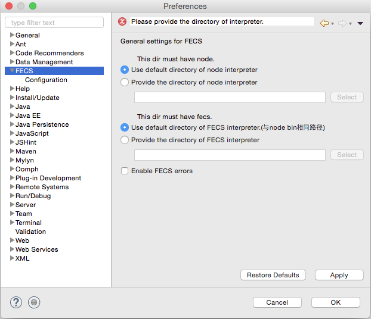
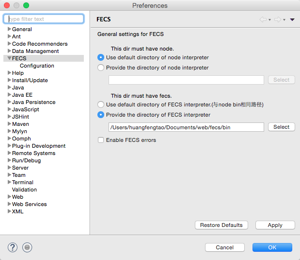

# fecs-eclipse

本插件在[jshint-eclipse](https://github.com/eclipsesource/jshint-eclipse)插件的基础上，进行修改和扩展。

## 使用前提

安装[node](https://nodejs.org/download/)，下载[fecs](https://github.com/ecomfe/fecs)

## 安装（更新）方式

在help选项卡的Install New Software下进行安装

+ 本地安装

下载该项目代码，点击Add -> Local... -> 打开项目的com.eclipsesource.fecs.update目录 -> OK

+ 在线安装

在work with一栏填写update网址：http://fental.github.io/Fental/update

## 使用方法

### 配置

激活插件在偏好设置(Preferences)中设置Node和FECS的bin路径：

如果eclipse可以获取系统环境变量，则可以使用Node的default路径，否则需要配置Node的bin路径。

**配置FECS的bin路径。**

配置完没有提示错误信息则可以正常使用。

### 启用

右键项目进入property可设置插件检查哪些文件

在Configuration子选项卡可以导入.fecsrc文件更细粒度的配置

### 代码检查

如图

### 代码格式化

可以通过点击工具栏的这两个按钮进行格式化（左侧的图标是格式化当前打开的文件，快捷键是command+6或者ctrl+6，暂不支持快捷键自定义；右侧的图标是格式化左侧选中的项目/文件夹/文件）

**格式化后不满意可通过回退来恢复原先文件内容**，使用格式化项目或者文件夹这个功能时，property的过滤器会起作用。