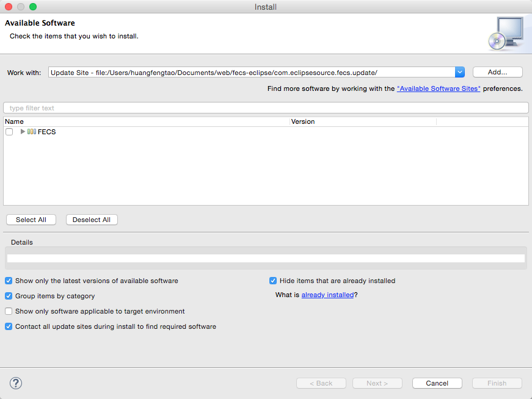

# fecs-eclipse

本插件在 [jshint-eclipse](https://github.com/eclipsesource/jshint-eclipse) 插件的基础上，进行修改和扩展。

## 使用前提

安装 [Node.js](https://nodejs.org/download/) ，下载 [fecs](https://github.com/ecomfe/fecs) 。

## 安装（更新）方式

在 help 选项卡的 Install New Software 下进行安装

+ 本地安装（更新）

下载该项目代码，点击 Add -> Local... -> 打开项目的 com.eclipsesource.fecs.update 目录 -> OK

+ 在线安装（更新）

在 Work with 一栏填写 update 网址：http://fental.github.io/Fental/update

## 使用方法

### 配置

激活插件在偏好设置（Preferences）中设置 Node.js 和 FECS 的 bin 路径：

如果 Eclipse 可以获取系统环境变量，则可以使用 Node.js 的 default 路径，否则需要配置 Node.js 的bin路径。

**配置 FECS 的 bin 路径。**

配置完没有提示错误信息则可以正常使用。

### 启用

右键项目进入 property 可设置插件检查哪些文件

在 Configuration 子选项卡可以导入 .fecsrc 文件更细粒度的配置

### 代码检查

如图

### 代码格式化

可以通过点击工具栏的这两个按钮进行格式化（左侧的图标是格式化当前打开的文件，快捷键是 command + 6 或者 ctrl + 6，暂不支持快捷键自定义；右侧的图标是格式化左侧选中的项目/文件夹/文件）

**格式化后不满意可通过回退来恢复原先文件内容**，使用格式化项目或者文件夹这个功能时，property 的过滤器会起作用。